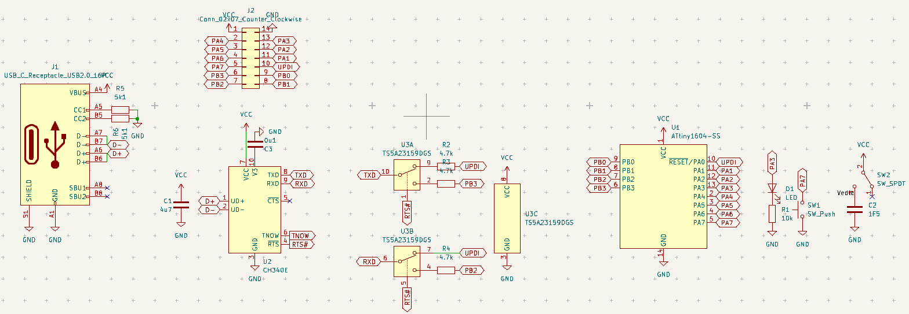
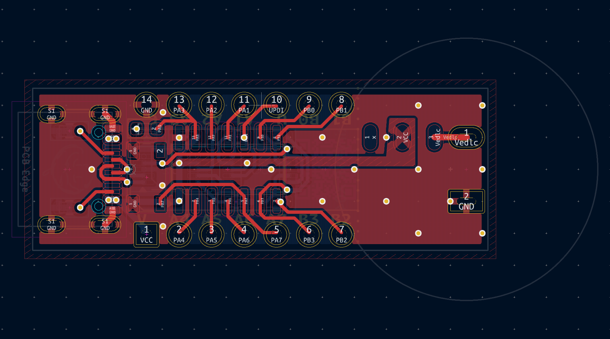
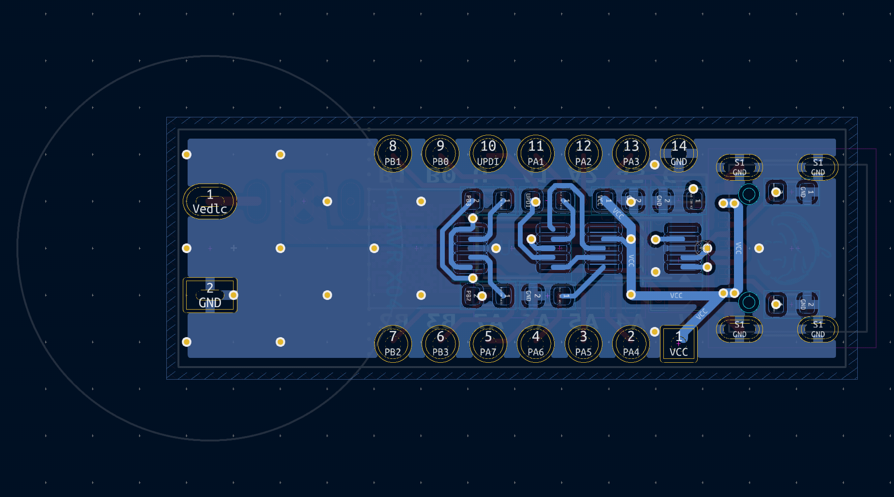
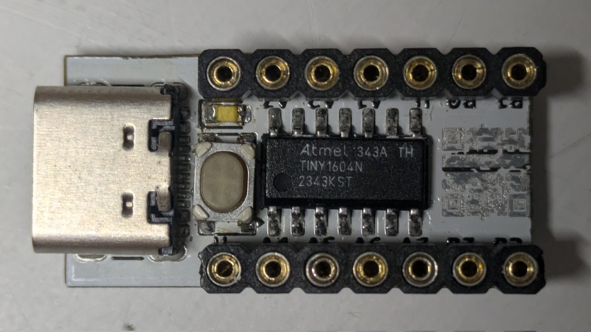
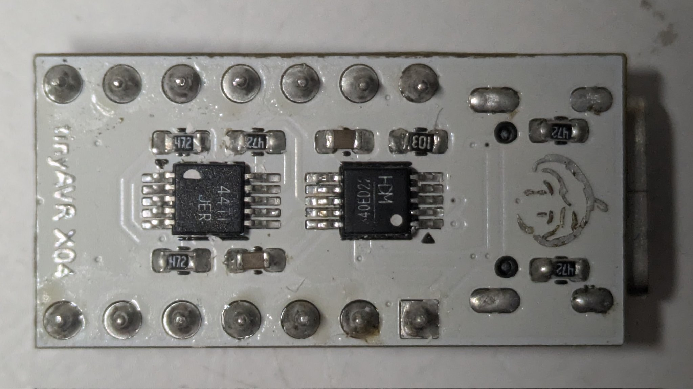

# tinyAVR X04 開発基板

ATtiny 204 404 804 1604 の開発基板

CH340Eによる書込回路付き

アナログスイッチによる書込<=>UART切替付き

<https://github.com/BlackBrix/SerialUPDI-programmer>

## エラッタ

アナログスイッチのUPDIとUARTが逆に配線されている

`avrdude -c seralupdi -p attiny1604 -P /dev/ttyUSB0`

Linuxでは疎通するがWindowsではしない

RTS#ピンのデフォルト状態の違いのせい?

### 解決策

- ***Linuxをインストール***
- アナログスイッチをつけずにUPDIの配線のみポリウレタン線等で行う

