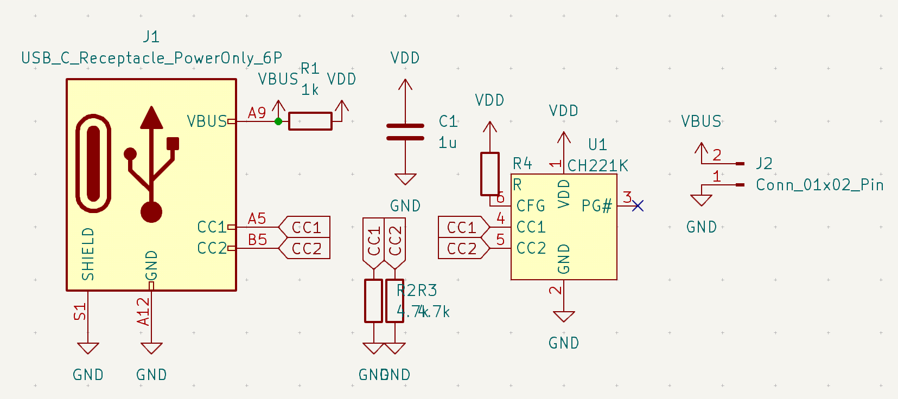
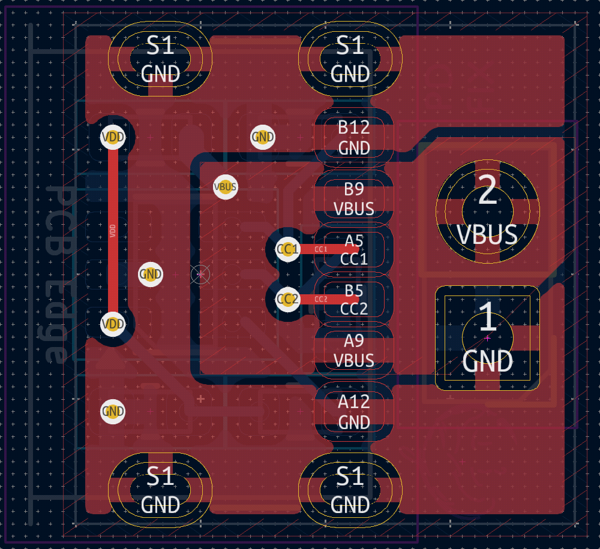
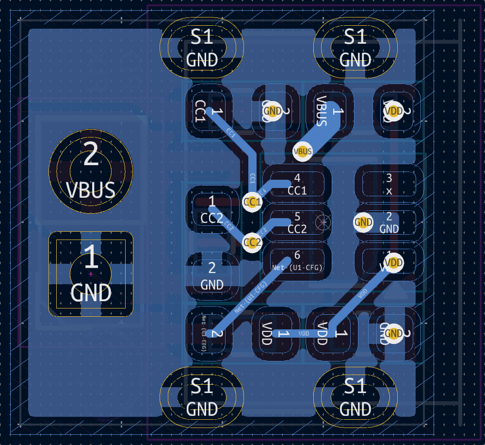
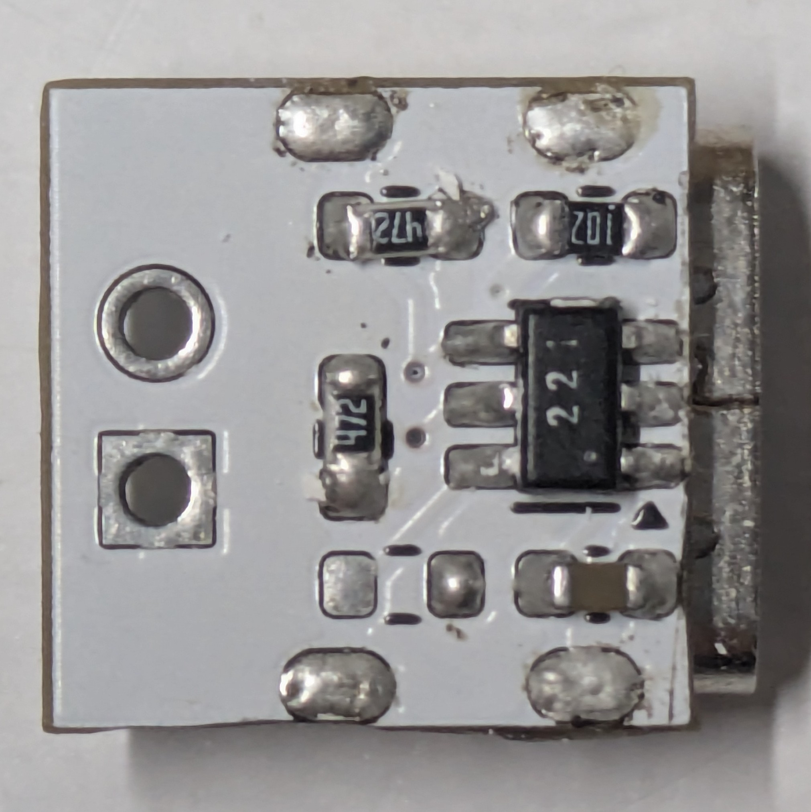

# pd-fix
USB-PDから固定電圧を引き出す小型基板

CH221Kをデータシートの通りに実装

PCのPD化改造などにどうぞ








実装していない箇所に電圧指定用の抵抗を配置

``` text
--------------------------------
電圧: 抵抗
================================
 5V: 10k
 9V: 20k
12V: 47k
15V: 100k
20V: 200k (150kで代用可)
--------------------------------
```